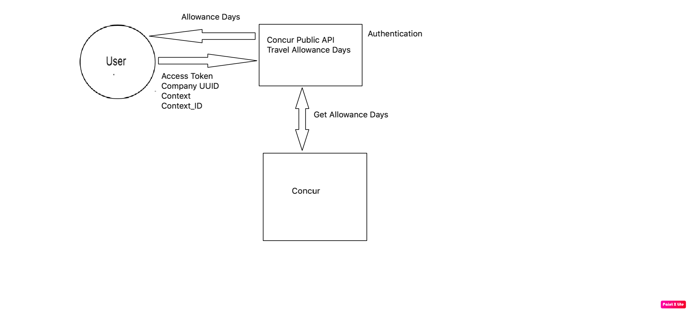

This Travel Allowance API fetches all the fixed allowance days in an expense report. Clients using this API can determine whether an allowance is a full day or partial day allowance.

> **Limitations**: This API is available only for Finland customers.

* [Process Flow](#process-flow)
* [Products and Editions](#products-editions)
* [Scope Usage](#scope-usage)
* [Access Token Usage](#access-token-usage)
* [Get Details of TravelAllowance Days](#details-of-travelallowance-days)
* [Schema](#schema)
  * [Error](#schema-error)
* [Definitions](#definitions)

## <a name="process-flow"></a>Process Flow




## <a name="products-editions"></a>Products and Editions

* Concur Expense Professional Edition
* Concur Expense Standard Edition

## <a name="scope-usage"></a>Scope Usage

Name|Description|Endpoint
---|---|---|
travelallowance.allowancedays.read|View the allowance days in an expense report|GET

## <a name="access-token-usage"></a>Access Token Usage

This API will work with Company access token only. A valid Company `access token` is needed to use this API.

## Retrieve a Company Access Token

Using Company-level access token is required for creating an integration with this API. This method will allow your integration to get fixed allowance day details of an expense report.  

For clients connecting to this API to build a custom integration you will receive client credentials and information on how to generate your company access token or company refresh token from the Web services resource assigned to assist you with Authentication.

Before making requests to this API, you must [obtain an access token from the Authentication API](/api-reference/authentication/getting-started.html).

The response will include an `access_token` field, which contains your access token. For subsequent calls, you will need to include this access token in the `Authorization` header of your calls. You will need this in order to get fixed allowance day details.

### Scopes

`travelallowance.allowancedays.read` - Refer to [Scope Usage](#scope-usage) for full details.

### Request

#### URI

##### Template

```shell
https://{datacenterURI}/api/v4/travelallowance/allowancedays/companyUUID/{companyUUID}/contexts/
{Context}/{ContextId}
```

##### Parameters

Name|Type|Format|Description
---|---|---|---
`companyUUID`|`uuid`|-|**Required** Note required when applicable.
`Context`|`string`|-|This parameter is required. For expense reports Context is `EXPENSE_REPORT`
`ContextId`|`string`|-|This parameter is required. For expense reports reportId of the report needs to be passed as contextId

#### Headers

* [RFC 7231 Content-Type](https://tools.ietf.org/html/rfc7231#section-3.1.1.5)
* [RFC 7231 Content-Encoding](https://tools.ietf.org/html/rfc7231#section-3.1.2.2)
* [RFC 7231 Accept](https://tools.ietf.org/html/rfc7231#section-5.3.2)
* [RFC 7231 Accept-Charset](https://tools.ietf.org/html/rfc7231#section-5.3.3)
* [RFC 7231 Accept-Encoding](https://tools.ietf.org/html/rfc7231#section-5.3.4)
* [RFC 7231 Accept-Language](https://tools.ietf.org/html/rfc7231#section-5.3.5)
* [RFC 7235 Authorization](https://tools.ietf.org/html/rfc7235#section-4.2)

#### Payload

* [Schema One](#schema-one)

### Response

#### Status Codes

* [200 OK](https://tools.ietf.org/html/rfc7231#section-6.3.1)
* [204 No Content](https://tools.ietf.org/html/rfc7231#section-6.3.5)
* [400 Bad Request](https://tools.ietf.org/html/rfc7231#section-6.5.1)
* [401 Unauthorized](https://tools.ietf.org/html/rfc7235#section-3.1)
* [403 Forbidden](https://tools.ietf.org/html/rfc7231#section-6.5.3)
* [404 Not Found](https://tools.ietf.org/html/rfc7231#section-6.5.4)
* [405 Method Not Allowed](https://tools.ietf.org/html/rfc7231#section-6.5.5)
* [408 Request Timeout](https://tools.ietf.org/html/rfc7231#section-6.5.7)
* [500 Internal Server Error](https://tools.ietf.org/html/rfc7231#section-6.6.1)
* [502 Bad Gateway](https://tools.ietf.org/html/rfc7231#section-6.6.3)
* [503 Service Unavailable](https://tools.ietf.org/html/rfc7231#section-6.6.4)
* [504 Gateway Timeout](https://tools.ietf.org/html/rfc7231#section-6.6.5)

#### Headers

* `concur-correlationid` is a Concur specific custom header used for technical support in the form of a [RFC 4122 A Universally Unique IDentifier (UUID) URN Namespace](https://tools.ietf.org/html/rfc4122)
* [RFC 7231 Content-Type](https://tools.ietf.org/html/rfc7231#section-3.1.1.5)
* [RFC 7231 Content-Encoding](https://tools.ietf.org/html/rfc7231#section-3.1.2.2)
* [RFC 7231 Content-Language](https://tools.ietf.org/html/rfc7231#section-3.1.3.2)
* [RFC 7231 Content-Location](https://tools.ietf.org/html/rfc7231#section-3.1.4.2)
* [RFC 7230 Content-Length](https://tools.ietf.org/html/rfc7230#section-3.3.2)

#### Payload

* [Schema One](#schema-one)
* [Error](#schema-error)

### <a name="details-of-travelallowance-days"></a>Get Details of TravelAllowance Days

#### Request

```shell
GET https://katre-report-service-banaras.us-west-2.nonprod.cnqr.deliveryapi/api/v4/
travelallowance/allowancedays/companyUUID/{companyUUID}/contexts/{Context}/{ContextId}
Accept: application/json
```
```json
{
  "companyUUID": "d5528866-51b1-40a1-bab2-76296a106dcd",
  "Context": "EXPENSE_REPORT",
  "ContextId": "B769E8B106C04F30AE27"
}
```

#### Response

```shell
HTTP/1.1 200 OK
Cache-Control: max-age=604800
Content-Type: application/json
Date: Wed, 06 Jul 2020 17:33:03 GMT
Etag: "359670651"
Expires: Wed, 13 Jul 2020 17:33:03 GMT
Last-Modified: Fri, 09 Aug 2020 23:54:35 GMT
Content-Length: 1270
```

```json
{
  "content": [
    {
      "ExpenseTypeCode": "MEALS",
      "FullAllowanceDay": "True",
      "AllowanceDate": "2018-09-244T12:00:00",
      "ExpenseTransactionDate": "2018-09-244T12:00:00",
      "ExpenseTransactionAmount": 29
    },
    {
      "ExpenseTypeCode": "MEALS",
      "FullAllowanceDay": "False",
      "AllowanceDate": "2018-09-247T12:00:00",
      "ExpenseTransactionDate": "2018-09-247T12:00:00",
      "ExpenseTransactionAmount": 29
    }
  ]
}
```

## <a name="schema"></a>Schema

### <a name="schema-one"></a>Get TravelAllowance Days Response Schema

Name|Type|Format|Description
---|---|---|---
`ExpenseTypeCode`|`string`|-|Expense Code. eg: MEALS for TravelAllowance.
`FullAllowanceDay`|`string`|-|Y/N. 'Y' means full allowance day and 'N' means partial allowance day.
`AllowanceDate`|`dateTime`|[dateTime](#definition-dateTime)|TravelAllowance Date.
`ExpenseTransactionDate`|`dateTime`|[dateTime](#definition-dateTime)|Expense transaction date.
`ExpenseTransactionAmount`|`numeric`|-|Expense transaction amount.

### <a name="schema-error"></a>Error

Name|Type|Format|Description
---|---|---|---
`errorCode`|`string`|-|A code that indicates a specific error code indicating why a particular field had failed validation.
`errorMessage`|`string`|-|**Required** Message associated with the error.
`dataPath`|`string`|-|Relative data path.

## <a name="definitions"></a>Definitions

Name|Type|Format|Description
---|---|---|---
<a name="definition-dateTime"></a>`dateTime`|`string`|-|DateTime of where the transaction happened in format specified in ISO 8601, using UTC + Offset. For example, 2016-04-22T12:20+0700 (12:20 PM in Pacific Time).
